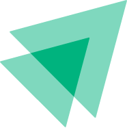
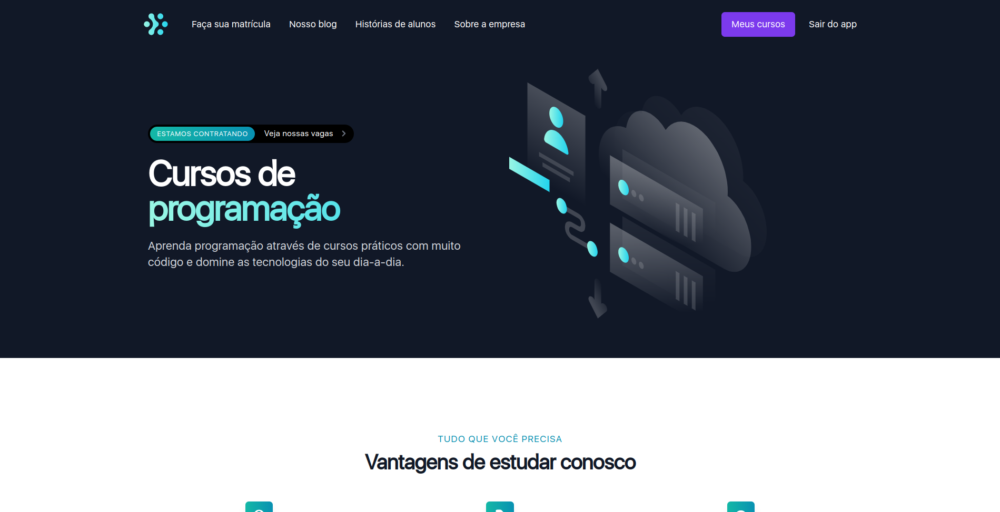
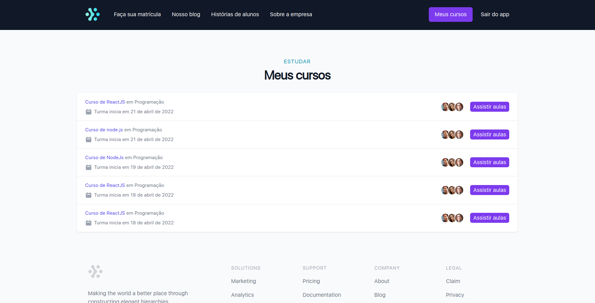
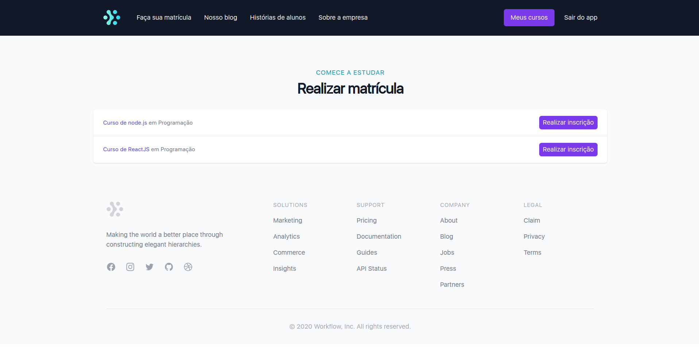
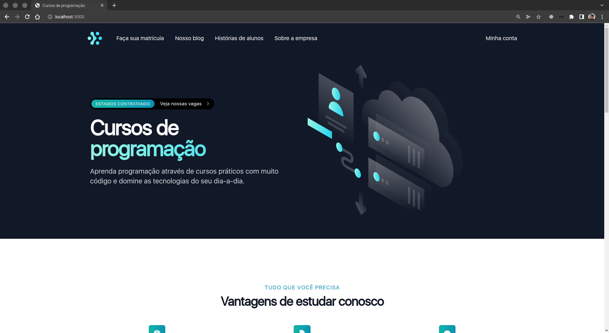

<h2 align="center">
  
</h2>

<h1 align="center">
    IGNITE - LAB
</h1>
<p align="center"> Application developed in the first edition of Rocketseat ignite-lab 💻🚀 </p>

<p align="center">
 <a href="#objective">Objective</a> •
 <a href="#technologies">Technologies</a> • 
 <a href="#usage">Usage</a> • 
 <a href="#contribution">Contribution</a> • 
 <a href="#author">Author</a> • 
 <a href="#demo">Demo</a> • 
 <a href="#license">License</a>
</p>

<h1 align="center">
  
<div style="display: flex; flex-direction: row;">
  
  
  <div>
</h1>

<h4 align="center"> 
	🚧 Ignite-lab | #1 ⏰📈 Loading...  🚧
</h4>

<h2 id="objective" > 🎯 Objective </h2>


An application with course purchase services, where the user can buy the product of his choice and the product owner will be able to register his courses.

<h2 id="technologies"> 🛠 Technologies </h2>

The following tools were used in the construction of the project:

- [ReactJS](https://reactjs.org)
- [NextJS](https://nextjs.org)
- [NodeJS](https://nodejs.org/en/)
- [NestJS](https://nestjs.com/)
- [GraphQL](https://graphql.org/)
- [Apache Kafka](https://kafka.apache.org/)
- [Apollo Client (GraphQL)](https://www.apollographql.com/docs/react/)
- [Yarn](https://yarnpkg.com) or Npm
- [VSCode](https://code.visualstudio.com)
- [Git Bash](https://gitforwindows.org/)

<h2 id="usage" > 👷 Usage </h2>

Required! Install git, node and yarn (or npm).

```bash
# Clone Repository
$ git clone https://github.com/RodrigoSaantos/ignite-lab.git

# Run Docker Compose
$ docker-compose up -d

# Go to folder classroom
$ cd classroom/

# Install Dependencies
$ yarn
# or
$ npm install

# Run Application
$ yarn start:dev
# or
$ npm run start:dev

# Access localhost
http://localhost:3334/graphql

# Go to folder purchases
$ cd purchases/

# Install Dependencies
$ yarn
# or
$ npm install

# Run Application
$ yarn start:dev
# or
$ npm run start:dev

# Access localhost
http://localhost:3333/graphql

# Go to folder gateway
$ cd gateway/

# Install Dependencies
$ yarn
# or
$ npm install

# Run Application
$ yarn start:dev
# or
$ npm run start:dev

# Access localhost
http://localhost:3332/graphql

# Go to folder web
$ cd web/

# Install Dependencies
$ yarn
# or
$ npm install

# Run Application
$ yarn dev
# or
$ npm run dev

# Access localhost
http://localhost:3000
```

<h2 id="contribution"> 🤝 Contribution </h2>

This project is for study purposes too. All kinds of contributions are very welcome and appreciated!

- Fork this repository;
- Create a branch with your feature: `git checkout -b my-feature`;
- Commit your changes: `git commit -m 'feat: My new feature'`;
- Push to your branch: `git push origin my-feature`.

<h2 id="author"> 💻 Author </h2>


By Rodrigo Santos 👋🏽 Find me:

[](https://www.linkedin.com/in/rodrigo-dos-santos-silva-637225156/) 
| 
[](mailto:contato.rodrigosaantos@gmail.com)

<h2 id="demo"> 🎌 Demo </h2>

<h1 align="center">
  <div style="display: flex; flex-direction: row;">
    
  <div>
</h1>

<h2 id="license"> 📝 License </h2>

This project is under the MIT license.